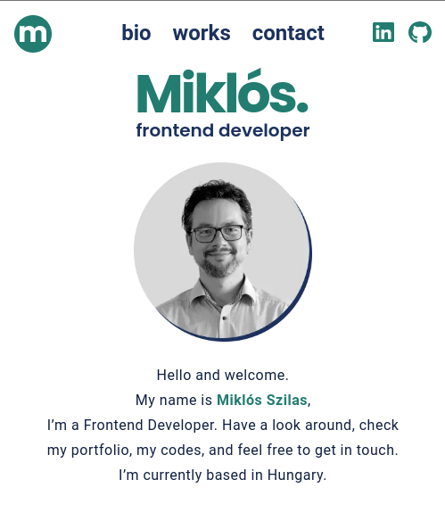

# Portfolio of Miklós Szilas, Frontend Developer

## Personal-professional website in Next JS

_STACK_

- Next JS 13
- TypeScript
- Sass
- GraphQL
- Contentful as headless CMS

### Install

NOTE: Since current version is for personal and demo purposes only, installation is virtually unnecessary.

`nvm ls`

- requires `Node` version `v18.14.1`

`npm i`

Contentful's credentials can be set in the `.env.local` file, which can be copied from the `.env.local.template` file.

### Run

`npm run dev`

_Designed in Figma_

.

